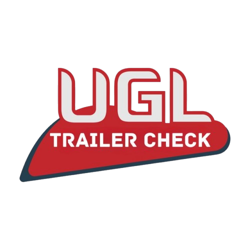
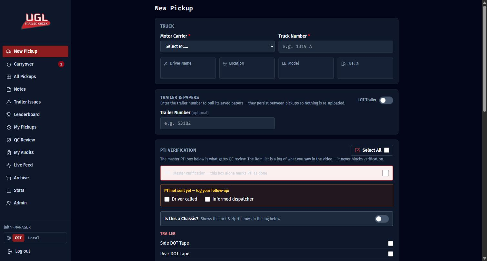
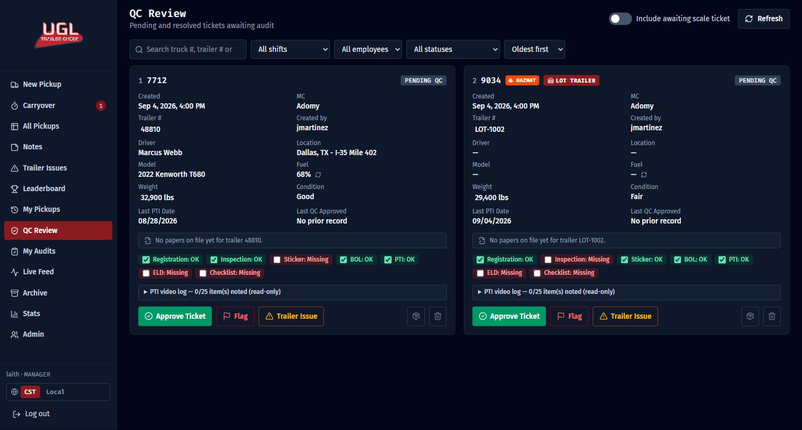
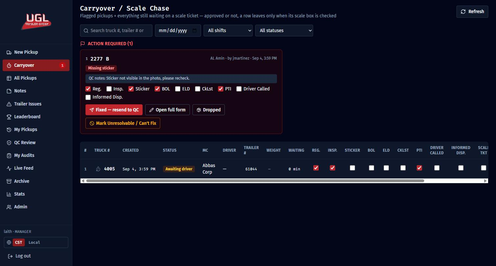
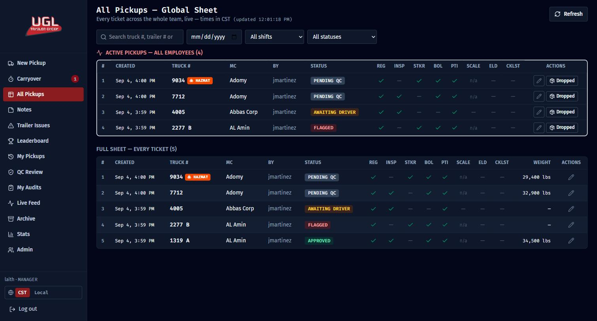
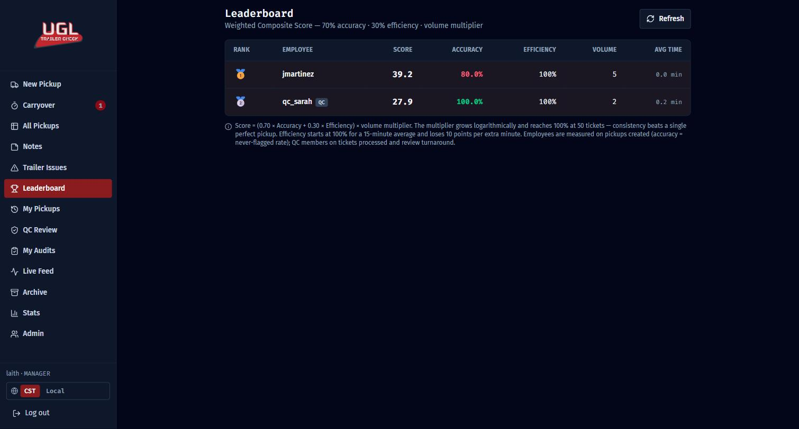
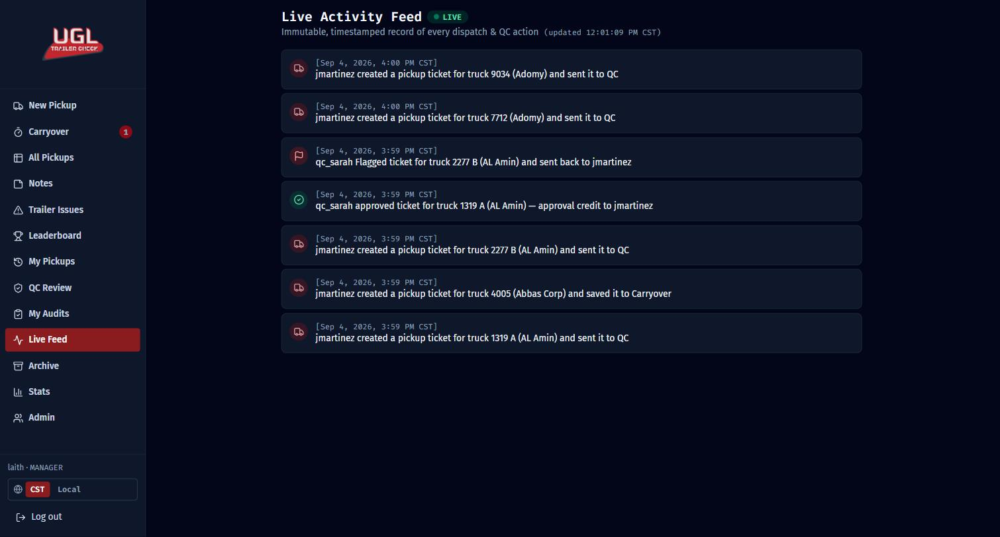
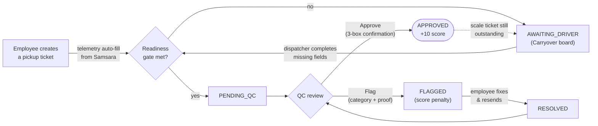

<div align="center">



# UGL Trailer Check

**Dispatch Trailer Check & Quality Control Platform**

*Replacing the shared spreadsheet with a strict, state-driven pickup pipeline, live telematics, and a gamified QC scoring engine.*

[](https://fastapi.tiangolo.com/)
[](https://nextjs.org/)
[](https://www.sqlalchemy.org/)
[](https://tailwindcss.com/)
[](https://www.postgresql.org/)
[](DEPLOYMENT.md)

[Full Technical Documentation](ARCHITECTURE.md) · [Deployment Guide](DEPLOYMENT.md) · [Design Specs](docs/)

</div>

---

## What it is

A three-role internal platform for a trucking dispatch operation: **employees**
log every trailer pickup through a guided form, **QC** audits every ticket
before it's considered done, and **managers** get a real-time command center.
Nothing here is generic SaaS scaffolding — every rule below exists because a
real dispatch floor needed it.

<table>
<tr>
<td width="50%" valign="top">

### 🚦 Strict ticket lifecycle
A pickup ticket moves through a real state machine —
`AWAITING_DRIVER → PENDING_QC → FLAGGED ⇄ RESOLVED → APPROVED` — enforced
server-side, not just in the UI.

### 📡 Live telematics, multi-carrier
Type a truck number and the Samsara Fleet API fills in driver, model, GPS
location, and fuel % automatically — routed through whichever Motor
Carrier's own API key applies.

### 🛡️ QC with intentional friction
Approval requires ticking 3 explicit confirmation boxes first. Flags carry
structured error categories, a 1–10 severity gauge, and photo/video proof.

### 🏆 Weighted composite scoring
A logarithmic volume-multiplied blend of accuracy and speed drives a live
leaderboard for both dispatchers and QC — one perfect ticket doesn't outrank
fifty consistent ones.

</td>
<td width="50%" valign="top">

### ☣️ Real-time hazmat watch
UGL doesn't haul hazmat. Flag a load hazmat and a background task watches
its GPS speed continuously — the instant it moves, every logged-in user
gets an unmissable live alert over Server-Sent Events.

### 🗂️ Trailers remember their own papers
Inspection & registration papers upload once per *trailer*, not per pickup
— they follow the trailer across every future load, no matter which truck
pulls it next.

### 📋 Auto-compiled shift handover
Missing items on a dispatcher's open tickets compile themselves into a
one-click "Publish Shift Handover" note for the next shift.

### 📊 Manager command center
A 5-second live activity feed, full filterable archive, multi-sheet Excel
export (one tab per day), and per-employee performance stats.

</td>
</tr>
</table>

---

## A look inside

<table>
<tr>
<td width="50%">

<p align="center"><sub>The intake form — telematics auto-fill, master PTI verification, persistent trailer papers</sub></p>
</td>
<td width="50%">

<p align="center"><sub>QC Review — hazmat & LOT-trailer badges, historical PTI context, inline quick-fixes</sub></p>
</td>
</tr>
<tr>
<td width="50%">

<p align="center"><sub>Carryover — flagged "Action Required" cards + the scale-ticket chase board</sub></p>
</td>
<td width="50%">

<p align="center"><sub>All Pickups — a live, read-only spreadsheet of the whole team's activity</sub></p>
</td>
</tr>
<tr>
<td width="50%">

<p align="center"><sub>Leaderboard — the weighted composite score, live</sub></p>
</td>
<td width="50%">

<p align="center"><sub>Manager Live Feed — an immutable, timestamped record of every action</sub></p>
</td>
</tr>
</table>

---

## How a pickup flows through the system



Every state transition — and every approve/flag/delete/drop — writes an
**immutable** audit-log + live-feed row, which is what powers the manager's
Live Feed and the Excel export's "no UUIDs, all readable" audit trail.

---

## Tech stack

| | |
|---|---|
| **Backend** | FastAPI · SQLAlchemy 2.0 · JWT auth (bcrypt + `python-jose`) · httpx (async) · openpyxl |
| **Frontend** | Next.js 15 (App Router) · React 19 · TypeScript · Tailwind CSS v4 · Zustand · lucide-react |
| **Database** | PostgreSQL in production · SQLite for local/LAN dev (zero-config, auto-created) |
| **Real-time** | Server-Sent Events for hazmat alerts · lightweight polling everywhere else |
| **Hosting** | Vercel (frontend) + Render (API + managed Postgres) — see [`render.yaml`](render.yaml) |

Curious how any of this actually works under the hood — every table, every
route, every state-machine rule, every frontend store? →
**[Read the full architecture doc](ARCHITECTURE.md).**

---

## Quick Start

### Windows — one command

```powershell
git clone https://github.com/LAEK-Soft/TrailerCheck.git
cd TrailerCheck
.\run.bat
```

`run.bat` installs Python/Node via `winget` if missing, sets up the venv and
npm packages, seeds the database, detects this machine's LAN IP and builds
the frontend against it, opens firewall ports (when run as admin), and
launches both servers in their own windows. Re-running it restarts the app
cleanly and picks up code or IP changes. It prints a URL teammates on the
same Wi-Fi can open directly.

**Optional:** copy `backend\mc_tokens.json` from an existing machine for
live Samsara telemetry (never committed — without it the app runs on
deterministic mock truck data).

<details>
<summary><b>Manual setup (macOS / Linux / step-by-step)</b></summary>

<br>

**Backend** (port 8000):

```bash
cd backend
python -m venv .venv && source .venv/bin/activate   # Windows: .venv\Scripts\activate
pip install -r requirements.txt

# Samsara tokens (optional — without them telemetry uses mock data):
# cp mc_tokens.example.json mc_tokens.json  and fill in real tokens.

export DATABASE_URL=sqlite:///./dev.db
python -m app.scripts.seed          # bootstrap manager account
uvicorn app.main:app --port 8000
```

Seeded login: **manager** `laith` / `laith123!` — create the rest of your
team (employee / qc accounts) from the in-app Admin page. Interactive API
docs: <http://localhost:8000/docs>.

**Frontend** (port 3000):

```bash
cd frontend
npm install
npm run dev        # or: npm run build && npm run start
```

The API base URL defaults to `http://localhost:8000` — override with
`NEXT_PUBLIC_API_URL` in your frontend environment.

</details>

---

## Environment Variables & Secrets

`backend/mc_tokens.json` (Samsara API tokens) and `backend/.env` (JWT
secret, Postgres URL) are gitignored — never commit them. See
[`ARCHITECTURE.md §6.2`](ARCHITECTURE.md#62-configuration) for the full
settings reference.

## Cloud Deployment

The frontend deploys to **Vercel** and the backend + PostgreSQL to
**Render** (via the included [`render.yaml`](render.yaml) blueprint).
Full step-by-step instructions: **[DEPLOYMENT.md](DEPLOYMENT.md)**.

## Documentation Map

| Document | What's in it |
|---|---|
| **[ARCHITECTURE.md](ARCHITECTURE.md)** | The complete as-built reference — every table, route, service, page, store, and interaction flow. Start here for anything technical. |
| **[DEPLOYMENT.md](DEPLOYMENT.md)** | Cloud deploy walkthrough (Render + Vercel), plus free-tier gotchas. |
| **[docs/](docs/)** | The original design-spec documents and their revision addenda — historical source of truth for *why* a business rule exists. |

---

<div align="center">
<sub>Built for a real dispatch floor. Every rule in this codebase exists because someone needed it — not because a spec template suggested it.</sub>
</div>
